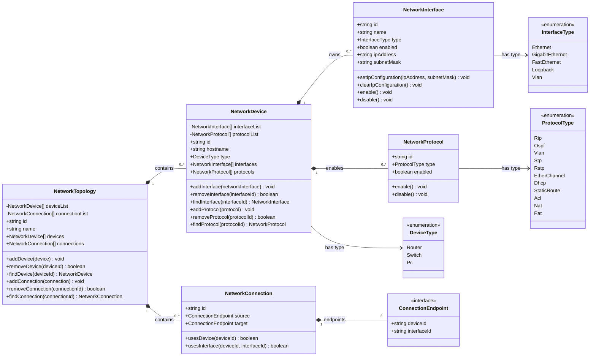

# UML-Klassendiagramm: Netzwerk-Datenmodell

Dieses Diagramm ist der geplante Stand für Subziel H1.c. Nach der
Implementierung muss es mit den tatsächlichen Klassen synchronisiert werden.

## Beziehungserklärung

- Eine Topologie enthält beliebig viele Geräte und Verbindungen.
- Ein Gerät besitzt seine Interfaces und aktivierten Protokolle.
- Eine Verbindung enthält genau zwei Endpunkte.
- Ein Endpunkt verweist über IDs auf ein Gerät und eines seiner Interfaces.
- Enums begrenzen Geräte-, Interface- und Protokolltypen auf bekannte Werte.

## Konsistenzprüfung nach Implementierung

- [ ] Alle dargestellten Klassen und Enums existieren im Code.
- [ ] Namen und Typen der öffentlichen Eigenschaften stimmen überein.
- [ ] Öffentliche Methoden stimmen mit der Implementierung überein.
- [ ] Kardinalitäten entsprechen der tatsächlichen Modelllogik.
- [ ] Änderungen aus dem Code-Review wurden im Diagramm nachgezogen.

